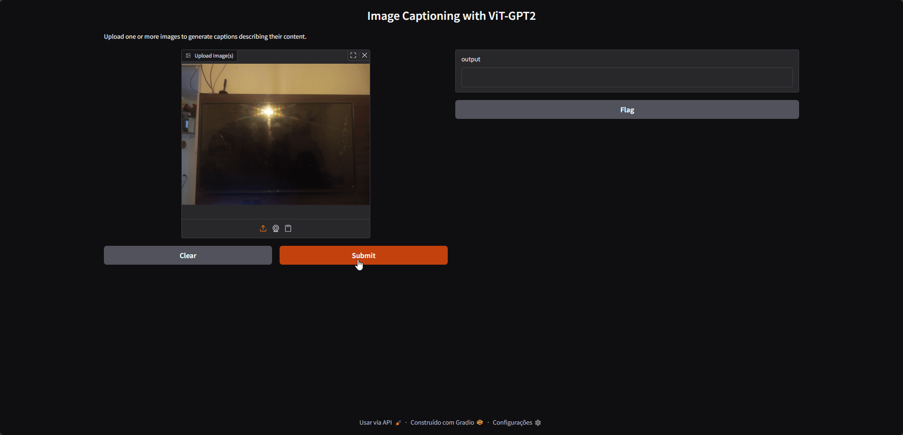
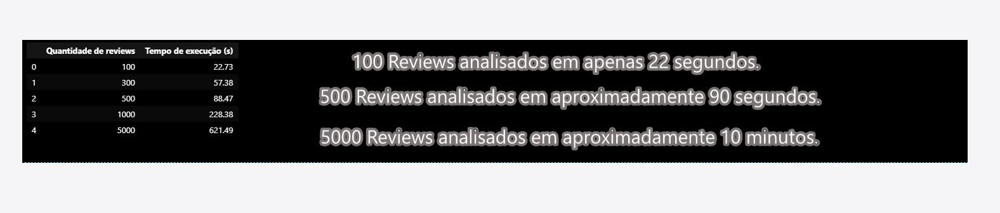
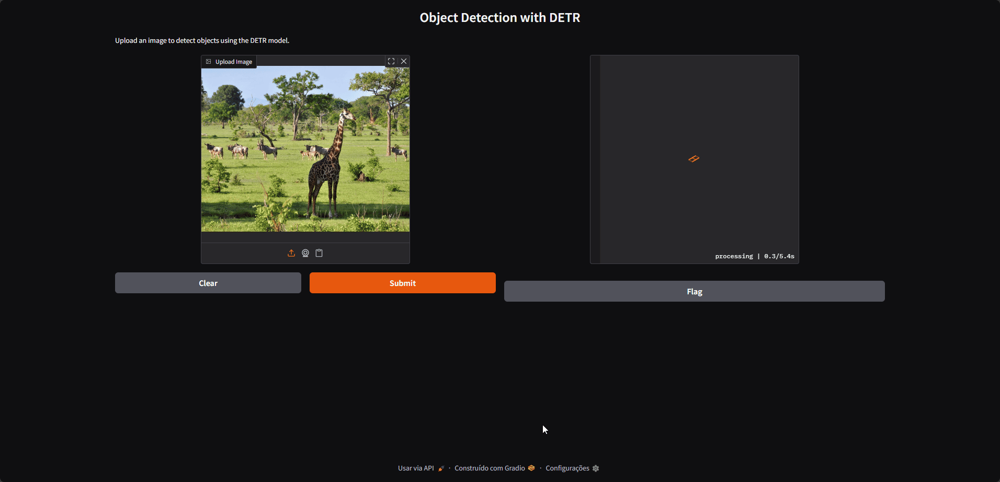

# 📦 Soluções de IA com Hugging Face
- Aplicações práticas que demonstram como IA generativa e visão computacional podem **reduzir custos, acelerar operações e aumentar eficiência** em cenários reais de negócio.

## 🛒 Projeto 1: Detecção Inteligente de Defeitos para E‑commerce
### Pipeline otimizado que combina:

- 1) RMBG‑2.0 para remoção de fundo → ***análises mais limpas, rápidas e com 30%–60% menos tokens.***

- 2) Gemini Flash para ***diagnóstico técnico instantâneo.***

- 3) Orientações automáticas para ***resolução de problemas comuns.***

- 4) Interface ***leve e intuitiva com Gradio.***


## 💼 Valor para o Negócio
A integração entre visão computacional e IA generativa gera **ganhos operacionais imediatos**:

| Benefício | Impacto |
| --- | --- |
| **Economia de tempo** | Até **40h/dia** de trabalho humano |
| **Economia financeira** | Até **R$ 240.000/ano** |
| **Economia de tokens** | Redução de **30%–60%** |
| **Velocidade de atendimento** | De 10 min → **50 seg** |
| **Escalabilidade** | Atende milhares sem ampliar equipe |
| **Padronização** | Diagnósticos consistentes |
| **Satisfação do cliente** | Respostas rápidas e claras |
| **Redução de erros** | Zero subjetividade humana |

## 📊 Projeto 2: Análise de Sentimentos em Reviews de E‑commerce
### Pipeline otimizado que combina:

- 1) Conexão direta com banco de dados PostgreSQL → consultas rápidas e seguras, sem camadas intermediárias.

- 2) Modelo HuggingFace DistilBERT → eficiente, barato e já fine‑tuned para sentiment analysis.

- 3) Batch processing inteligente → redução de latência e melhor aproveitamento de recursos.

- 4) Interface leve e intuitiva com Gradio → visualização clara de métricas e distribuição de sentimentos.



## 💼 Valor para o Negócio
A integração entre banco de dados real e IA generativa traz **impacto imediato para operações de e‑commerce:**

| Benefício | Impacto |
| --- | --- |
| **Economia de tempo** | Consultas diretas → até **10x mais rápidas** |
| **Economia financeira** | Uso de modelo HuggingFace → **baixo custo operacional** |
| **Velocidade de análise** | De milhares de reviews em minutos → **segundos** |
| **Escalabilidade** | Processa até **5.000 reviews por execução** |
| **Padronização** | Classificação consistente e confiável |
| **Satisfação do cliente** | Insights rápidos para decisões estratégicas |
| **Redução de erros** | Zero subjetividade humana |
| **Transparência** | Logs automáticos de performance |

### ⚡ Reviews analisados em tempo otimizado



## ✈️ Projeto 3: Image Captioning com ViT‑GPT2
### Pipeline otimizado que combina:
- 1) Vision Transformer (ViT) para extração robusta de features visuais.

- 2) GPT‑2 para geração automática de descrições textuais.

- 3) Integração com Gradio para uma interface leve e interativa.

- 4) Suporte a upload de imagens e API para fácil integração em outros sistemas.



## 🌍 Valor para o Mundo Real
A união entre visão computacional e modelos de linguagem abre **aplicações práticas em diversos setores:**

| Aplicação | Impacto |
| --- | --- |
| **Acessibilidade digital** | Geração de descrições automáticas para pessoas com deficiência visual |
| **E‑commerce** | Catálogos com legendas automáticas → maior clareza e SEO otimizado |
| **Educação** | Apoio em materiais didáticos com descrições visuais consistentes |
| **Segurança** | Monitoramento inteligente de imagens em tempo real |
| **Mídia e Jornalismo** | Indexação rápida de fotos para bancos de dados |
| **Automação de processos** | Redução de trabalho manual em classificação e anotação |
| **Escalabilidade** | Processa milhares de imagens sem intervenção humana |
| **Padronização** | Legendas consistentes e sem subjetividade |


## 🦒 Projeto 4: Detecção de Objetos com DETR‑ResNet‑50
### Pipeline otimizado que combina:
- 1) DETR (Detection Transformer) para detecção direta e eficiente de objetos.

- 2) ResNet‑50 backbone para extração de features visuais robustas.

- 3) Interface leve e intuitiva com Gradio para visualização interativa dos resultados.

- 4) Suporte a upload de imagens e API para integração em sistemas externos.


## 🌍 Valor para o Mundo Real
A detecção automática de objetos com modelos baseados em Transformers abre espaço para **aplicações práticas em diversos setores:**

| Aplicação | Impacto |
| --- | --- |
| **Agronegócio** | Monitoramento de animais e plantações em tempo real |
| **Segurança** | Vigilância inteligente com identificação automática de pessoas e objetos |
| **E‑commerce** | Catálogos com reconhecimento automático de produtos |
| **Saúde** | Apoio em diagnósticos por imagem (radiografias, exames visuais) |
| **Educação** | Ferramentas interativas para ensino de visão computacional |
| **Mídia e Jornalismo** | Indexação rápida de fotos e vídeos |
| **Automação industrial** | Inspeção de qualidade em linhas de produção |
| **Escalabilidade** | Processa milhares de imagens sem intervenção humana |
| **Padronização** | Detecção consistente e sem subjetividade |


## 🚀 Como rodar localmente

```bash
pip install -r requirements.txt
python app.py
```

##  Estrutura do Projeto

```Huggingface-Solutions/
│
├── Interface                    # Amostras da Interface (GIFs)
├── app.py                       # Aplicação (Suporte Automatizado para E-commerce)
├── app02.py                     # Aplicação (Análise de Sentimentos Otimizada)
├── image_classification.py      # Classificação de Imagens
├── image_to_text.py             # Aplicação (Descrição Automática de Imagens variadas)
├── object_detection.py          # Aplicação (Detector Automático de Objetos em Imagens variadas)
│
├── requirements.txt             # Dependências do projeto
└── README.md                    # Documentação do Projeto
```